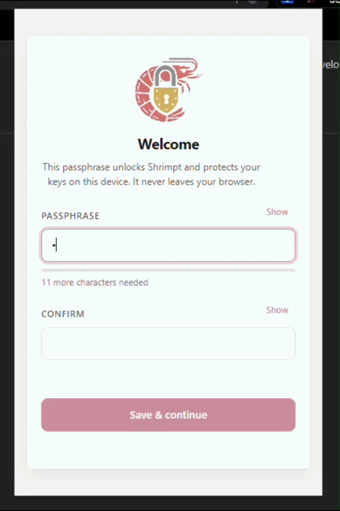
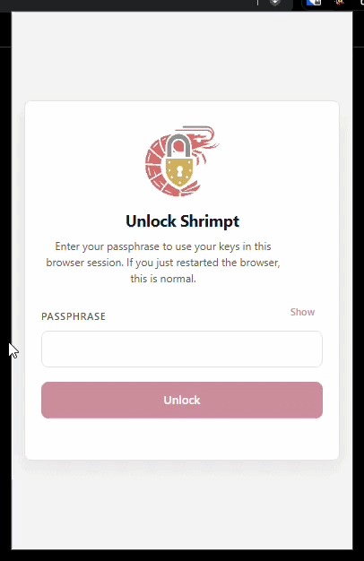
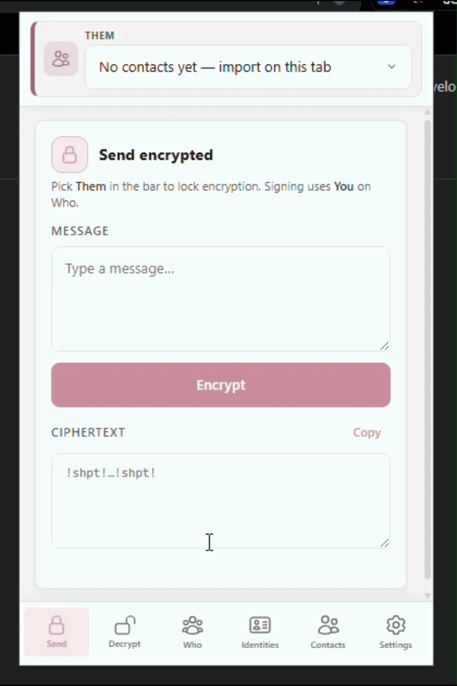
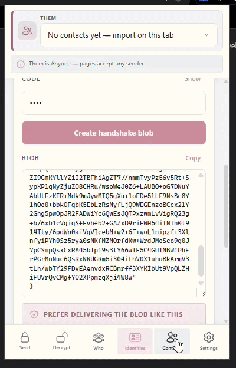
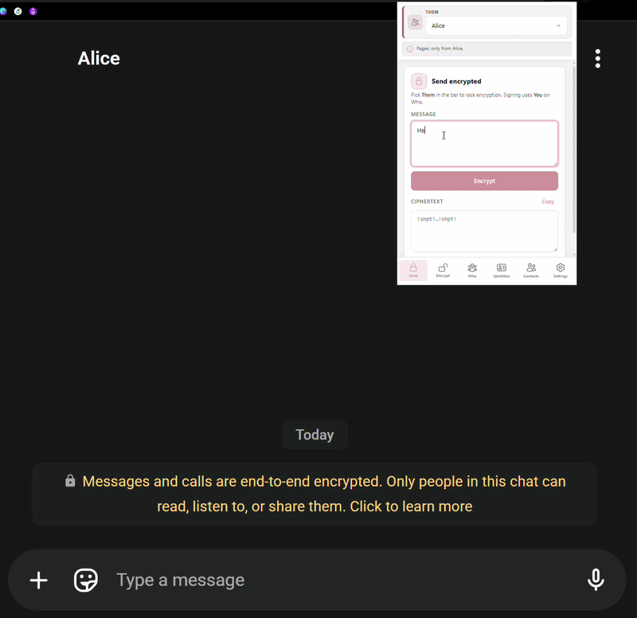
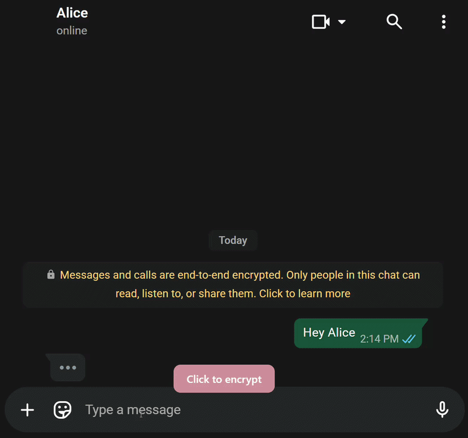

# Shrimpt

**Inline end-to-end encryption for any web page.**

Shrimpt is a Chrome extension (Manifest V3) that lets you encrypt and decrypt messages directly inside any web page. Type a message, encrypt it for a specific contact, and paste the ciphertext into social media, email, forums — anywhere that accepts text. Recipients with Shrimpt installed see the decrypted message inline, rendered safely inside a closed Shadow DOM.

Ciphertext is wrapped in recognizable delimiters (`!shpt!...!shpt!`) so the extension can detect and decrypt it automatically as you browse.

## How It Works

1. **Identity generation** — Each user creates one or more profiles, each backed by an RSA-OAEP key pair (encryption) and an RSA-PSS key pair (digital signatures).
2. **Contact exchange** — Public keys are shared via encrypted "handshake" blobs protected by a short code, or as plain JSON.
3. **Hybrid encryption** — Messages are encrypted with a random AES-256-GCM key, which is then RSA-OAEP wrapped for both the recipient *and* the sender (dual envelope), so either party can decrypt later.
4. **Signature** — The entire ciphertext payload is signed with RSA-PSS so recipients can verify the sender's identity.
5. **Inline decryption** — A content script scans the page for ciphertext markers using a `MutationObserver` and replaces them with decrypted plaintext chips inside closed Shadow DOM, preventing the host page from reading the content.

## Features

- Encrypt and decrypt from the popup
- Automatic page scanning for ciphertext
- Session locking with PBKDF2-derived passphrase (310,000 iterations)
- Full encrypted backup export/import
- SHA-256 fingerprints for key verification
- Zero external dependencies — all crypto uses the Web Crypto API
- No network calls — everything runs locally

## Cryptographic Primitives

| Purpose               | Algorithm                               |
| --------------------- | --------------------------------------- |
| Asymmetric encryption | RSA-OAEP 2048-bit, SHA-256              |
| Symmetric encryption  | AES-256-GCM, 12-byte IV                 |
| Digital signatures    | RSA-PSS 2048-bit, SHA-256, 32-byte salt |
| Key derivation        | PBKDF2-HMAC-SHA-256, 310,000 iterations |

## Design Choices

- **Sender ID inside the ciphertext** — The encrypted inner payload carries the sender's profile ID. This is not redundant with the RSA-PSS signature: the signature proves authorship, but the recipient needs to know *which* public key to verify against. The embedded ID enables O(1) key lookup instead of trial-verifying against every contact. It also allows conversation filtering and retroactive verification when a contact is imported later. Since it lives inside the AES-GCM body, it is invisible to anyone who cannot decrypt.

- **Dual envelope** — The AES session key is RSA-OAEP wrapped for both recipient and sender. This lets the sender decrypt their own sent messages without storing plaintext locally, keeping the system stateless.

- **Encrypt-then-sign** — The signature covers the entire ciphertext (IV + both RSA wraps + AES-GCM ciphertext). Combined with the sender ID inside the encrypted body, signer-substitution attacks fail: an attacker can re-sign the blob, but the inner ID won't match their key on verification.

- **No external metadata** — The wire format is an opaque binary blob. No sender fingerprint, recipient hint, timestamp, or version field is exposed outside the ciphertext. The only information visible to the platform is that a Shrimpt message exists and its length.

## Installation

No build step required. This is a pure vanilla JavaScript extension.

1. Clone this repository
2. Open `chrome://extensions/` in Chrome
3. Enable **Developer mode** (top-right toggle)
4. Click **Load unpacked** and select the project directory
5. The Shrimpt icon appears in the toolbar

## Usage

### 1. Create a passphrase

Set an unlock passphrase on first launch. This protects your keys on the device and never leaves the browser.

### 2. Unlock Shrimpt

Enter the passphrase to unlock your keys for the browser session.

### 3. Create an identity and export it

Generate a profile (RSA key pairs) and export the public key as a handshake blob to share with contacts.

### 4. Import a contact

Import a contact's public key from a handshake blob or plain JSON.

### 5. Send an encrypted message from the popup

Type a message in the popup, encrypt it for a contact, and copy the ciphertext to paste anywhere.

### 6. Send and read encrypted messages directly from the app

Encrypt text in-place from any text field on a page, and see decrypted messages appear inline automatically.

## Tech Stack

- **Runtime**: Chrome Extension (Manifest V3)
- **Language**: Vanilla JavaScript (ES modules)
- **Crypto**: Web Crypto API (`crypto.subtle`)
- **Storage**: `chrome.storage.local` + `chrome.storage.session`
- **UI**: Plain HTML/CSS, no frameworks
- **Build**: None
- **External dependencies**: None

## Limitations

- **Text only** — Cannot encrypt images, files, or other binary content.
- **Chrome only** — Built as a Manifest V3 Chrome extension. Other Chromium-based browsers may work but are not officially supported.
- **Both parties need the extension** — Recipients must have Shrimpt installed to decrypt messages.
- **No forward secrecy** — RSA key pairs are long-lived. Compromise of a private key exposes all past messages encrypted to that key.
- **No key revocation** — There is no mechanism to revoke a compromised key or notify contacts.
- **Manual key exchange** — Contact public keys must be exchanged out-of-band. There is no key server or automatic discovery.
- **No group encryption** — Each message is encrypted for a single recipient.
- **Local storage only** — Keys live in `chrome.storage.local`, tied to the browser profile. Losing the profile without a backup means losing all keys.
- **Platform compatibility** — Some websites may strip, truncate, or re-encode the ciphertext delimiters, breaking decryption.
- **RSA 2048-bit key size** — While standard today, RSA-2048 may become insufficient against future advances. The Web Crypto API does not yet support post-quantum algorithms.